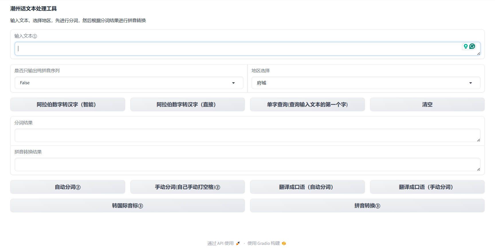

### 潮州话文本处理工具（pyPengIm）介绍

本项目是潮汕话语音合成（text-to-speech，TTS）的铺垫工作，用于潮汕话的文本端处理。在语音合成中，通常分成文本前端、声学模型、声码器三个模块，而对于中文类的语音合成，文本前端（特别是汉字-拼音转换模块）对语音合成的结果影响巨大。目前，由于（~~砖家叫兽们不干人事~~）潮汕话的网络资料极少，基本为民间爱好者自建网站，而缺乏较为权威的机构或高校整理和发布，因此，潮汕话的正字法、汉字-拼音转换模块、拼音到音素转换、区域口音转换工具、拼音转国际音标工具等等，均是一片空白。

为了解决当前研究的空白，本项目基于1960年的潮汕话拼音方案，以及 [潮州音字典](http://www.czyzd.com/)、[潮州母语网（潮典）](https://www.mogher.com/baike)、[learn teochew](https://learnteochew.com/)提供的资料，构建起一个文本处理工具，支持以下功能：

- 1、支持从汉字输入，并输出对应的潮汕话拼音，可以输出常用高频的读音，也可输出所有的读音。

- 2、支持分词功能和多音字消歧功能。

- 3、默认以潮州市区的府城音为标准，并支持将府城音转换到汕头市区音、揭阳市区音、澄海口音等，后续将尝试支持更多口音，如饶平、汕头市郊音等口音。

- 4、支持将普通话的词汇，翻译为更地道的潮汕话口语表达。

- 5、支持将潮拼转为国际音标。

- 6、支持GUI操作。 

- **7、[在线UI-demo](https://huggingface.co/spaces/panlr/teochew_pyPengIm)**

### 本项目存在的一些不足：

- 1、所有资料基本由本人一人爬取、整理、组织，不可避免存在一定的疏漏和错误。

- 2、本人非汉语言专业，对声韵学的理解可能存在不足。

- 3、本项目暂不支持潮汕话连读的变调处理，所有拼音输出均保持原调。这是因为：

    - 不同地区的变调规律不一定一致
    - 具体的变调，往往取决于说话人的主观决定、断句或语境
    - 变调时，该字的音调常常不在潮汕话的8个基础音调之内。若用更细致的调值法，则工程量会更大，难以扩大化数据工作

- 4、不包括潮普惠的练江音，因为与韩江音、榕江音差别大，视为异常点
- 5、本工具的转换映射均采用字典暴力映射，初始加载效率较低，有待优化
- 6、缺少智能词性判读，针对姓氏、人名、数字、特殊地名等情况，需要半手动处理

### 最近更新
* [2025/04/23] 
  - 去除姓氏文件中**不需要异读的部分**；
  - 增加对中国古代 **年号（reign_title）** 的支持（尽可能用文读音），主要是处理【咸】【天】【安】【元】【大】等字的多音字消歧
  - 增加中国古代名词（朝代、政权名、民族、人名、官职）的拼音词典（history.txt）
  - 新增三种韩-榕混合口音：**泛金石音（gimzieh-general, gz-g）**、**经典金石音（gimzieh-classical, gz-c）**、**庵埠音（ampou, ap）**
    - 泛金石音：广泛分布在金石、沙溪，以及彩塘和龙湖（镇）的部分地方，特点是无闭口、榕江化（即[ing][ig]并入[êng][êg]，[iêng][iêg][uêng][uêg]并入[iang][iag][uang][uag]）。此外，【乞】（表示给、被）读【koih4】，【橄榄】读[gai1 nai2]，【每】读[mui2]，【某（人）】读[mung2]；**三组声韵母组合[boi][bhoi][poi]（以及其对应的鼻化韵）习惯上并入[buê][bhuê][puê]**，如【买】读作[bhuê2]，【批】读作[puê1]，【畔】读作[buên5]。
    - 经典金石音：分布在金石、沙溪和龙湖（镇）部分地方，特点是在泛金石音的基础上，部分韵母为[o]的字，变为展唇，读为[ɤ]，在本仓库中记为[eo]。如【坐】读【zeo6】(国际音标：[tsɤ25])，袋读【deo7】(国际音标：[tɤ21])。
    - 庵埠音：类似泛金石音，无闭口，榕江化，【乞】（表示给、被）读【koih4】，但保留[boi][bhoi][poi]以及其鼻化韵。森、鲹、参、糁由[siam1]变为[sing1]。韵母[iê][iên][iêh]变为[io][ion][ioh]，但实际读法和揭阳、汕头的[io][ion][ioh]略有区别。
    - **三种口音的映射可能存在一定的错漏，欢迎本地人指出**
  - 支持自定义口音
  - 修改潮州音字典部分错误
  - 修改 【𠶧】，将其分为【昣@diang1】和【倎@diang5】，分别表示“时候”、“谁”。
  - 新增GUI界面


### 使用方法/示例

#### 1、默认模式。
声明实例，调用类函数，默认是优化模式（以府城音为标准），并自动用jieba库分词，输出最优匹配的读音。

```
from script.pyPengIm import pyPengIm 

pinyin_tool = pyPengIm()
print(pinyin_tool.pinyin('中心 企业'))

输出：
{'result': [['中心', ['dong1'], ['sim1']], ['企业', ['gi6'], ['ngiab8']]], 'pinyin_seq': 'dong1 sim1 gi6 ngiab8', 'surname_notice': []}

print(pinyin_tool.pinyin('方耀 翁万达')) 

输出：
{'result': [['方耀', ['bung1'], ['iou6']], ['翁万达', ['êng1'], ['bhuêng7'], ['dag8']]], 'pinyin_seq': 'bung1 iou6 êng1 bhuêng7 dag8', 'surname_notice': [['方', ['bung1']], ['翁', ['êng1']]]}
```

默认情况下，.pinyin()接口会返回一个字典，包含三个key：
```
'result'：对应的内容是一个列表，列表的每一个item都代表一个【分词-拼音对】，类型也是列表，
item的第一个元素是当前的【分词】，若分词有n个字，那么接下来就会有n个元素，每一个元素代表第i个字的读音列表。

在默认的情况下，会自动根据分词进行多音字消歧，上述例子中的【中】、【企】都是多音字，通过词典的规则匹配锁定正确读音。

'pinyin_seq'：由于'result'的层次结果稍复杂，所以提供直接的拼音序列。

'surname_notice'： 潮汕话中的姓氏读音较为特殊且复杂，当前工具还未智能化，无法判断一个词是否应该用特有的姓氏异读，所以输出surname_notice作为提示。
上述例子中的【方】、【翁】都是姓氏，需要采用专门的姓氏读法。

```

#### 2、 多音字模式 
设置`heteronym=True`，启用多音字模式。输出每一个字符的所有潜在读音，带星号（*）表示该音较为低频，或者只存在于少数特定词汇，如【家己】、【目的】等。

```
pinyin_tool.pinyin('家中',heteronym=True)

输出：
{'result': [['家', ['gê1', 'gia1*', 'ga1*', 'kia1*']], ['中', ['dong1', 'dang1', 'dong3', 'dêng3']]], 'pinyin_seq': 'gê1|gia1|ga1|kia1 dong1|dang1|dong3|dêng3', 'surname_notice': []}
```
上述例子中，【家】字有4个读音，但只有【gê1】是较常用的，【ga1】只用于【家己】，【gia1】用于古文、古诗词，【kia1】用于方言词汇【私@sai1 家@kia1】、【私家钱】等，表示私人的、私房的（但似乎现在也较少用这词）。

而【中】字也同样也4个读音，在普通话里有 zhōng、zhòng 两个读音，两个读音分别有文读、白读，所以在潮汕话里就有4个读音，其中，【zhōng】对应【'dang1'（白），'dong1'（文）】，【zhòng】对应【'dong3'（文）, 'dêng3'（白）】。


#### 3、口音转换
默认情况下，输出府城音(tc)，通过`accent`参数，可以转为汕头（st）、澄海（th）、揭阳（ky）三种口音
```
pinyin_tool.pinyin('恁揭阳')['result'] # 潮州府城口音
pinyin_tool.pinyin('恁揭阳',accent='st')['result'] # 转汕头口音
pinyin_tool.pinyin('恁揭阳',accent='th')['result'] # 转澄海口音
pinyin_tool.pinyin('恁揭阳',accent='ky')['result'] # 转揭阳口音


分别输出：
[['恁', ['ning2']], ['揭阳', ['gig4'], ['iên5']]]
[['恁', ['ning2']], ['揭阳', ['gig4'], ['ion5']]]
[['恁', ['neng2']], ['揭阳', ['gig4'], ['iên5']]]
[['恁', ['nêng2']], ['揭阳', ['gêg4'], ['ion5']]]

```
#### 4、 分词方式
中文语境特殊，不同的分词情况，可能会导致不同的读音。通过`auto_split`提供两种分词模式：

- 4.1 jieba自动分词，借助jieba工具分词并替换

- 4.2 手动打空格分词，在jieba工具不智能的情况下使用，并且可以获取选取备选词，方便下一步做口语化转换。样例见5、


#### 5、口语转化
为了让潮汕话文本更贴近真实口语，可以通过`.to_oral`实现口语转化，将部分词汇替换为潮州方言词。转换之后，再通过上述的`.pinyin`接口转换为拼音。带'#'的词汇表示发声转换的词汇，采用本地方言读法。

```

oral_text=pinyin_tool.to_oral('你要去哪里玩',auto_split=True)# 自动分词
print(oral_text)
# pinyin_tool.pinyin(oral_text) ## 转拼音

oral_text=pinyin_tool.to_oral('我 要 去 做生意',auto_split=False)# 自动分词不准，手动打空格分词。
print(oral_text)

输出：
你 欲# 去 底块# 𨑨迌#
我 欲# 去 做生理#
```
- 备选词模式
  部分普通话词汇会对应多个潮汕话词汇，或者该普通话词汇不一定非要转，这部分词汇我在 [映射词典](./dict_data/word_dict/madr_to_tch.txt)中，采用加数字1、2、3、4的方式控制转换。
  ```
    print(pinyin_tool.to_oral('晚上 晚上1 晚上2 晚上3',auto_split=False))# 加数字1、2、3，启用备选词

    输出：
    暝囝# 夜旰# 一夜# 夜昏囝#
  ```


- '#'控制是否启用本地词汇模式，因为有部分词汇分别可以作为本地词和普通话词汇，在两种情况下读音不同。
  ```
    print(pinyin_tool.pinyin('生理')['pinyin_seq'])# 既作为普通话词义，表示生物体的有机活动
    print(pinyin_tool.pinyin('生理#')['pinyin_seq'])# 只作为潮汕话词义，表示生意 
    
    输出:
        sên1 li2
        sêng1 li2

    print(pinyin_tool.pinyin('倚赖')['pinyin_seq'])# 普通话词义，表示依赖、依靠
    print(pinyin_tool.pinyin('倚赖#')['pinyin_seq'])# 潮汕话词义，表示诬陷、诬赖 

    输出:
      i2|in2 nai6
      ua2 lua7

  ```

#### 6、单字模式
查询单个字的所有读音和所有口音
```
print(pinyin_tool.single_query('生'))

{'潮州': ['生', ['sên1', 'cên1', 'sêng1']], '汕头': ['生', ['sên1', 'cên1', 'sêng1']], '澄海': ['生', ['sên1', 'cên1', 'sêng1']], '揭阳': ['生', ['sên1', 'cên1', 'sêng1']]}

```

#### 7、转国际音标（IPA）
输入潮州拼音序列，输出IPA序列（列表格式），其中，每一个item的声母、韵母、声调用空格风格
```
pinyin_seq=pinyin_tool.pinyin('我吃蘑菇中毒了')['pinyin_seq']
print(pinyin_tool.to_IPA(pinyin_seq))

输出：['ua ˥˧', 'ŋ ɯk ˨', 'm o ˥', 'k ou ˧', 't oŋ ˨˩˧', 't ak ˥', 'l iou ˨˩˧'] 
```

#### 8、音素模式
输出更小的音素单元（【声母 韵母+声调】），主要是便于MFA（Montreal Forced Aligner）等工具的训练

```
pinyin_seq=pinyin_tool.pinyin('我吃蘑菇中毒了')['pinyin_seq']
print(pinyin_tool.to_phoneme(pinyin_seq))

输出：['ua2', 'ng eg4', 'm o5', 'g ou1', 'd ong3', 'd ag8', 'l iou3']
```

#### 9、阿拉伯数字处理，若输入阿拉伯数字，请先手动转成汉字

中文对于阿拉伯数字的读法有很灵活的读法，有时逐字念（手机号、身份证号、学号、班级号、年份、邮政编号等），并且【一】有时还读成【幺】；有时则念成数值。这类情况最好是自己手动检查转换。
```
from script.utils import num_to_chinese,num_to_chinese_smart
print(num_to_chinese('15')) #【一 幺】五
print(num_to_chinese('120')) # 【一 幺】二零

print(num_to_chinese_smart('15')) # 十五
print(num_to_chinese_smart('120')) # 一百二十

```


#### 10、字典中不包含的汉字或字符，输出'None'字符。
```
print(pinyin_tool.pinyin('*',accent='ky')['result']) # 转揭阳口音
[['*', ['None']]]
```

#### 11、自定义口音
只需要在`dict_data/accent_convert`目录下，增加自己的口音映射文件，然后在`accent.yaml`中增加索引值，如：
```accent.yaml
ky: 
  path: to_Kityall.txt
  name: "揭阳"
st: 
  path: to_Swatow.txt
  name: "汕头"
th: 
  path: to_Tenhigh.txt
  name: "澄海"
new_accent: 
  path: to_new_accent.txt
  name: accent_name
```
其中，`to_new_accent.txt`需要以下列格式：
```
{字}_{府城音}#{目标口音}
反_huêng2#huang2
爿_puêng5#puang5
畔_puêng3#puang3
扮_buêng6#buang6
```

以泛金石音、经典金石音、庵埠音为例，在`accent.yaml`中写：
```accent.yaml
ky: 
  path: to_Kityall.txt
  name: "揭阳"
st: 
  path: to_Swatow.txt
  name: "汕头"
th: 
  path: to_Tenhigh.txt
  name: "澄海"
gz_c: 
  path: to_Gimzieh_c.txt
  name: "金石-经典"
gz_g: 
  path: to_Gimzieh_g.txt
  name: "金石-泛"
ap: 
  path: to_Ampou.txt
  name: "庵埠"
```


#### 12、谐音字查询正字【待定】
由【奥】查询【沤】，由【华普】查询【喝誧】,【拉普】查询【喇誧】。[TODO]

### 图形界面版本
以交互方式调整分词、口音、口语翻译、阿拉伯数字转汉字和拼音标注。

```
运行：
python gui_server.py

浏览器打开：
http://127.0.0.1:7860
```




### [潮州话拼音方案](http://www.czyzd.com/data/chaopin)和标准音
目前，在各种潮汕话的文字或网络资料中，最通用的是广东省教育部门于1960年9月公布的潮州话拼音方案（Pêng'im），该方案以汕头市的口音为基础，以拉丁字母拼写语音，声调标数字显示，总共包括了17个声母（不计零声母）、59个韵母、8个基础声调。

但事实上，该方案不收录有音无字或例字甚少的韵母，如aon （好）、uên（横）、uin（畏）、oun（虎）、iun（幼）、uain（县）、aoh（乐）和eg（乞）等；也不收录其他地区特有的韵母，如潮州市区的iêng（焉）、uêng（冤）、iêg（噎）和uêg（越）等韵母。若考虑这部分未收录的韵母，潮汕话的韵母超过80个。

此外，潮汕话的声调也不止8个。在连读时，潮汕话存在非常复杂的变调情况，有些音调经过变调之后，变成8个基础调之外的衍生调。若考虑衍生调以及不同地区的不同情况，潮汕话总共有10多个声调。

南方方言普遍十里不同音，潮汕话作为一门以口头交流为主的方言，自然也有着多种多样的口音种类，往大了分，通常按照河流分成韩江音、榕江音、练江音和黄冈河音。往细了分，光是汕头市区（金平、龙湖），也可分成四五种口音。要在文本端处理，就需要指定其一为标准。本项目遵循【潮州音字典】，以潮州的府城音为标准。


#### 为什么以府城音为标准音？
潮州府城音主要分布以潮州府城、北关、意溪、归湖、文祠等地，具有明显的闭口韵、伪前鼻音（iêng、uêng），是韵母数量最多的一种口音之一，相比于其他口音，对汉字的读音具有较高的区分度。并且，相比于人口频繁流动的平原地区，分布在丘陵山地的府城音，口音的演变较慢，因此也更稳定。


### 歹看正字法(Pain-Kuan Orthography,PKO)

潮汕话并非官方语言，因此没有人为指定的语言规范和正字标准。潮汕人在影视作品的字幕以及互联网上的文章、文字评论，甚至某一些专家的关于民俗、方言的论文里，通常都用谐音字来表示。

少部分情况下，谐音字有可取之处，例如，自己人写成“胶己人”，男人写成"打埠"，姘头、奸夫写成“老衍”(本字是“嫪毐”，战国时期的奸夫)，迎老爷写成"营老爷"等等，倒是无伤大雅，甚至还更容易看懂。


但是多数情况下，使用谐音字既不统一，也不准确；而专家们考证的本字或者正字方案，也存在明显的不足和缺漏，如多音字过多，词义与现代普通话冲突，仍然严重的有音无字现象，合音字问题，训读字、俗写字或异体字导致书写不统一的问题等。

综上所述，我需要对现有的专家方案进行改进，以减少多音字数量、减少词汇冲突和歧义、减少同一个字担负太多词义、统一写法为宗旨，构建起一套书写标准，以便于潮汕话的汉字-拼音转换，更多内容请看[歹看正字法](./doc/readme.md)


